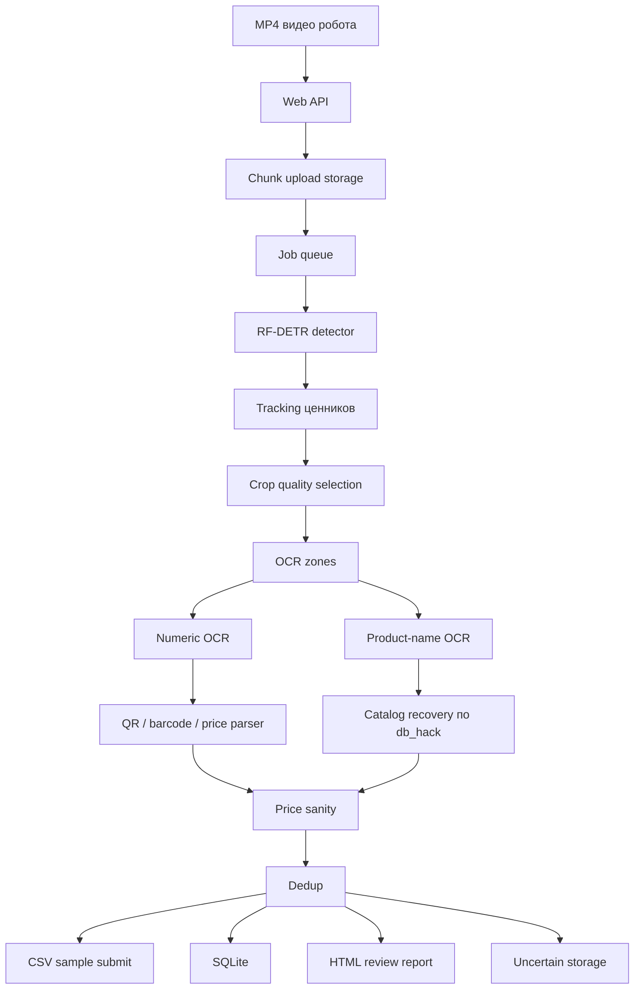

# Shelf Vision: распознавание ценников по видео полки

Shelf Vision принимает MP4-видео прохода робота вдоль стеллажа и возвращает CSV в формате `sample.csv`: название товара, цены, скидки, barcode/sku, координаты ценника, QR-поля и служебные признаки. Решение рассчитано на поток видео из разных магазинов: результаты сохраняются в SQLite, crops для проверки уходят в отдельный HTML/ZIP-отчёт, а неуверенные предсказания складываются для последующего дообучения.

Демо-стенд:

https://via-thus-visibility-shore.trycloudflare.com

Health check:

https://via-thus-visibility-shore.trycloudflare.com/api/health

## Коротко

- Полный цикл: загрузка видео, детекция ценников, OCR, восстановление по `db_hack`, sanity-check цен, дедупликация, CSV.
- Инференс локальный: модель, OCR и каталог работают без внешних API.
- Результаты сохраняются не только в браузере: CSV, SQLite, manifest, HTML/ZIP-отчёт по crops, uncertain-хранилище.
- Загрузка больших MP4 идёт по частям: браузер отправляет файл блоками, а сервер запускает обработку после полной сборки файла.
- Архитектура готова к горизонтальному масштабированию: видео, кадры и crops можно распределять между workers.
- Для воспроизведения приложен `artifacts_for_judges.zip`: в нём уже лежат каталог и checkpoint в нужной структуре.

## Что важно для проверки

- **Качество распознавания**: pipeline не ограничивается OCR “как есть”. После детекции идут tracking, выбор лучшего crop, несколько OCR-веток, сверка с точным каталогом `db_hack`, проверка ценовых аномалий и дедупликация повторов.
- **Соответствие формату**: результат экспортируется в CSV со схемой `sample.csv`, включая товарные поля, цены, скидки, barcode, QR-поля, координаты и служебные признаки.
- **Воспроизводимость**: в репозитории есть Dockerfile, `docker-compose.yml`, проверка артефактов, README-инструкция и архив `artifacts_for_judges.zip` для полного запуска.
- **Архитектура**: web/API, detector, OCR, catalog recovery, postprocess, хранилище результатов и review-отчёты разделены на понятные этапы.
- **Масштабирование**: обработка естественно раскладывается по видео, кадрам и crops; GPU-детекцию, CPU/OCR workers и reducer можно запускать отдельно.
- **Демонстрация**: есть живой web-стенд, загрузка MP4 через браузер, прогресс обработки, скачивание CSV и отдельный HTML/ZIP-отчёт для проверки сложных случаев.

Ссылка для последнего слайда презентации:

```text
Код, Docker-запуск, инструкция и артефакты для воспроизведения:
https://github.com/R2NN/projecthack
```

## Архитектура



Основные компоненты:

- `web/` — UI, API, очередь задач, progress/ETA, SQLite writer, metrics endpoint.
- `pipeline/` — inference/training scripts: детекция, OCR, catalog recovery, postprocess.
- `artifacts/` — внешние артефакты: `db_hack.csv`, веса моделей, закрытые данные.
- `runtime/` — локальные результаты: jobs, CSV, logs, crops, SQLite, HTML-отчёты.

## OCR-стратегия

Мы не используем один универсальный OCR для всех полей. У ценника разные зоны имеют разную визуальную природу, поэтому pipeline использует разные инструменты под разные категории:

- **RF-DETR**: детектирует сам ценник на кадре.
- **OpenCV preprocessing**: нормализация crops, зоны, бинаризация, геометрия и фильтры качества.
- **RapidOCR**: быстрый OCR для числовых и коротких полей: обычная цена, barcode digits, sku/id, дата печати, служебные коды.
- **EasyOCR**: дополнительный OCR для сложных ценовых зон, прежде всего цена по карте и скидочные поля.
- **Tesseract rus+eng**: product-name fast path, где важны длинные строки на русском и английском.
- **PaddleOCR**: альтернативный/расширяемый путь для product-name и additional_info, оставлен в scripts для дальнейшего улучшения.
- **Catalog recovery**: финальная сверка с `db_hack`, чтобы OCR-шум не превращался в произвольное название товара.

Такой подход устойчивее, чем “один OCR на всё”: цена, barcode и название товара требуют разных preprocessing, разных confidence-порогов и разной логики восстановления.

## Быстрый запуск UI

```bash
git clone https://github.com/R2NN/projecthack.git
cd projecthack
docker compose up --build
```

Открыть:

```text
http://localhost:5173
```

Без внешних артефактов поднимется web-интерфейс и API, а `/api/health` покажет, каких файлов не хватает для полного инференса.

## Полный запуск инференса

Самый простой путь для судей — скачать `artifacts_for_judges.zip` из корня репозитория и распаковать его в корень проекта. После распаковки должна появиться структура:

```text
artifacts/
  db_hack.csv
  models/
    rfdetr_small_price_tag_all_annotated_tiled1280_e8_checkpoint_best_total.pth
```

Архив хранится через Git LFS, поэтому при обычном `git clone` нужен установленный Git LFS. Если LFS не установлен, файл можно скачать с GitHub через браузер.

Проверка:

```bash
python tools/check_artifacts.py
```

Запуск:

```bash
INSTALL_PIPELINE_DEPS=true docker compose up --build
```

В PowerShell:

```powershell
$env:INSTALL_PIPELINE_DEPS="true"
docker compose up --build
```

Если нужно собрать контейнер вместе с Python-зависимостями pipeline:

```bash
docker build --build-arg INSTALL_PIPELINE_DEPS=true -t shelf-vision-full .
```

Для GPU в Docker нужен NVIDIA Container Toolkit и совместимые драйверы. В промышленном контуре лучше разделять web/API и GPU workers: web остаётся лёгким сервисом, а workers масштабируются отдельно.

## Артефакты модели

Веса и каталог не лежат в обычной Git-истории как большие бинарные blob-файлы. Для удобства проверки они приложены отдельным LFS-архивом:

```text
artifacts_for_judges.zip
```

Внутри архива:

```text
artifacts/
  db_hack.csv
  models/
    rfdetr_small_price_tag_all_annotated_tiled1280_e8_checkpoint_best_total.pth
```

Почему так:

- checkpoint весит около 121 МБ;
- модель является производным артефактом обучения;
- архив даёт воспроизводимость без ручной передачи файлов;
- Git LFS не раздувает обычную историю исходного кода;
- checkpoint можно заменить новым архивом без переписывания структуры проекта.

## Локальный Windows-запуск

```powershell
cd web
$env:LENTA_PIPELINE_ROOT="A:\lenta_pipeline\handoff_v19_speed_full_pipeline_20260518_040946"
$env:LENTA_CATALOG_PATH="A:\lenta_data\db_hack.csv"
$env:LENTA_DETECTOR_CHECKPOINT="A:\lenta_pipeline\handoff_v19_speed_full_pipeline_20260518_040946\models\rfdetr_small_price_tag_all_annotated_tiled1280_e8_checkpoint_best_total.pth"
$env:LENTA_WEB_RUNTIME_ROOT="A:\lenta_web_runtime"
python server.py --host 127.0.0.1 --port 5173
```

Публичный стенд через Cloudflare Tunnel:

```powershell
cd web
.\start_public_site.ps1 -Restart
```

## Результаты и отчёты

После обработки создаются:

- `combined_submission.csv` — итоговая выгрузка;
- `manifest.json` — служебная информация по job;
- `review/review_manifest.json` — данные crops для проверки;
- `review/review_report.html` — HTML-отчёт по crops, открывается отдельной ссылкой после обработки;
- `review/review_package.zip` — автономный пакет с HTML-отчётом, manifest и изображениями crops;
- `uncertain_predictions/<job_id>/` — неуверенные предсказания для ревью и будущего обучения;
- `lenta_results.sqlite` — база с jobs, строками CSV, review items и агрегатами.

На главном экране crops не показываются сеткой, чтобы интерфейс оставался чистым. Для проверки сложных случаев есть отдельный HTML-отчёт и записи в SQLite.

## Метрики

API:

```text
GET /api/metrics
```

Уже считаются:

- количество jobs, успешных и упавших задач;
- количество видео и строк ценников;
- fill-rate по `barcode`, `product_name`, `price_card`, `price_default`;
- число скидочных строк;
- средние цены;
- подозрительные случаи, где цена по карте выше обычной;
- количество crops для review;
- количество uncertain predictions;
- топ видео по числу найденных ценников.

Для сети магазинов эти метрики расширяются до:

- качества распознавания по магазину, дате, камере и маршруту;
- доли товаров без barcode или с низкой уверенностью;
- списка магазинов с большим числом ценовых аномалий;
- товаров, которые часто не матчятся с каталогом;
- SLA обработки: очередь, время на видео, throughput, ошибки workers;
- контроля промо: скидочные ценники, расхождения цены карты и QR;
- контроля выкладки относительно планограммы или expected assortment.

## Почему решение масштабируется

Pipeline естественно раскладывается на map-reduce:

```text
map workers:
  видео / кадры / crops
  -> detection
  -> OCR
  -> field candidates

reduce stage:
  candidates
  -> tracking merge
  -> catalog recovery
  -> price sanity
  -> dedup
  -> CSV + metrics
```

При росте нагрузки можно добавить новые workers:

- GPU workers для RF-DETR detection;
- CPU/OCR workers для OCR и postprocess;
- отдельный reducer для merge/dedup/export;
- общий object storage для видео, crops и результатов;
- PostgreSQL/ClickHouse вместо локального SQLite.

Это важно для крупного бизнеса: система не привязана к одному компьютеру и не требует ручной обработки каждого видео.

## Ресурсы

Минимально для UI/API:

- 2 vCPU — два виртуальных CPU-потока, не два физических процессора;
- 2-4 GB RAM;
- 5 GB disk под runtime;
- Docker или Python 3.11+.

Для полного локального инференса:

- GPU с 6 GB VRAM может быть достаточен для RF-DETR small на текущих настройках;
- 8 GB VRAM — рекомендуемый минимум с запасом для стабильной работы;
- 16 GB RAM;
- 20-30 GB disk под модели, runtime и crops;
- Python 3.12 окружение с RF-DETR/OCR-зависимостями;
- Tesseract + русский language pack;
- `db_hack.csv` и checkpoint детектора.

CPU-only режим технически возможен для части pipeline, но для демонстрации и массовой обработки он слишком медленный. Практичный вариант — GPU для detection и CPU/OCR workers для остального.

## Лицензии и чистота поставки

Репозиторий очищен от лишних тяжёлых и потенциально закрытых файлов. В обычную Git-историю не включены:

- видео с полок;
- обучающие датасеты;
- отдельные веса моделей (`.pth`, `.pt`, `.ckpt`, `.onnx`) вне LFS-архива;
- PDF/PPTX материалы хакатона;
- runtime-логи, SQLite, crops, uncertain-хранилище;
- брендовые ассеты заказчика.

В репозитории лежат:

- исходный код web/API;
- исходники pipeline;
- `sample.csv` только как header-схема итоговой выгрузки;
- Docker/compose/инструкции;
- скрипты проверки окружения.
- `artifacts_for_judges.zip` через Git LFS для воспроизведения проверки.

Почему это важно:

- рабочие видео, логи и промежуточные crops не попадают в публичную историю Git;
- веса модели упакованы отдельно и могут быть заменены новым checkpoint без изменения кода;
- third-party библиотеки не vendored в проект, а устанавливаются через package managers;
- зависимости можно проверить по `pipeline/requirements-gpu.txt`;
- поставка воспроизводима: код, Docker-инструкция и нужные артефакты находятся по одной ссылке.

Код проекта распространяется по MIT License, см. `LICENSE`. Названия сторонних продуктов и библиотек принадлежат их правообладателям. Перед production-внедрением зависимости фиксируются и проходят стандартную проверку лицензий и безопасности.

## Структура

```text
.
├── web/                 # UI, API, jobs, metrics, SQLite writer
├── pipeline/            # inference/training pipeline без весов и датасетов
├── artifacts/           # локальные внешние артефакты, не коммитятся
├── tools/               # проверки окружения
├── artifacts_for_judges.zip
├── Dockerfile
├── docker-compose.yml
└── README.md
```

## Проверки

```bash
python -m py_compile web/server.py
node --check web/app.js
python -m compileall pipeline/scripts
python tools/check_artifacts.py
docker compose config
```

`check_artifacts.py` завершится ошибкой на чистом clone, если `artifacts_for_judges.zip` ещё не распакован в `artifacts/`. Это ожидаемо.
